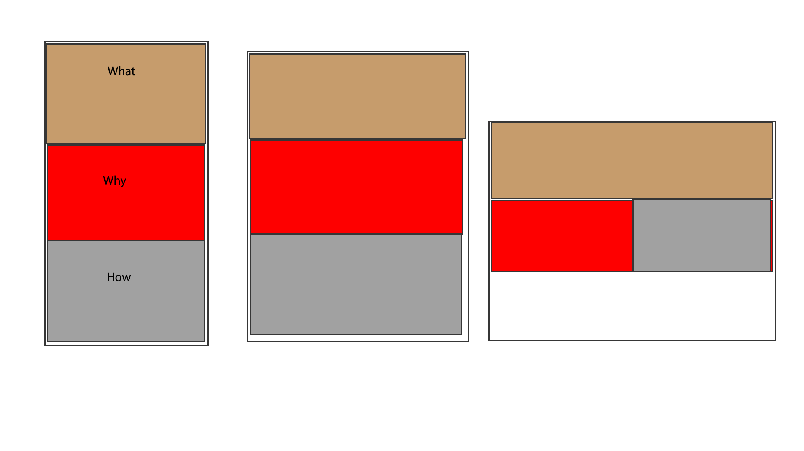

# Week 10

1. Read Week 10 Overview
2. Read RWD Intro
-Watched video on skinny ties
- Watched video of emaples
- Went to sites to check responsivity
- Tumblr does to a degree, then uses scroll bars.
- Moodle is responsive.
- Watched Pan, Zoom, Touch video
- Watched Emulators video
- Checked out emulator
- Watched End of Introduction
3. Read Viewport and Pixels
- Watched Viewpoint video
- Watched Pixels Video
- Watched Pixelation Videos
- Watched Calculating dpr videos
- Watched "What's the difference" videos
- Watched viewport width videos
- Watched setting the viewport
- Read Using the viewport meta tag
- watched viewport quiz videos
3. Read Width
- Watched Large Fixed Width Elements video
- Watched max-width on elements video
- watched relative sizes videos
4. Tap Target
- Watched Tap videos
5. Read Mobile First Design
- watched start small videos
- watched solution videos
6. Read media queries
- Intro to Responsive Design Patterns video
- Intro to media queries video
- Looked at example
7. Media Queries in CSS
- Watch media queries videos
8. Breakpoints
- skinnyties website
- skinnyties video
- Breakpoint videos
9. Complex Media Queries
- videos
10. Flexbox
- Flexbox videos
- Looked at examples
11. More With Flexbox
- “How Flexbox Works” by Scott Domes
- “Even More About How Flexbox Works” by Scott Domes
- “A Visual Guide to css3 Flexbox Properties”
- Flexbox Playground
- “A Complete Guide to Flexbox” by Chris Coyier
12. Layout Design Patterns
- Patterns video
13. Column Drop Layout
- Column Drop video
14. Mostly Fluid Layout
- mostly fluid video
- looked at example
15. Layout Shifter
- Watched video
- Looked at holy grail layout
16. Off Canvas
- watched video
- looked at example
17. More Design Patterns
- “Responsive Web Design Patterns” by Pete LePage
- “5 Really Useful Responsive Web Design Patterns” by CMV Blog
- “A collection of patterns and modules for responsive designs”
- “Design jargon explained: web design patterns”
18. Sketching Responsive Web Designs and Wireframes
- better responsive web design process.
19. Sketches of website
- 
20. Index and Css started
21. Fix Problems
22. Pushed to github
23. Fixed Problems
24. Pushed to github
- What is the information this page aims to deliver? -
What Responsive Web Design is

79. What is the first information on the page that should draw the eye? - First Definition of RWD
80. What is the primary content of this page? - Explaination of RWD
8. What is the secondary content? - Why and how one should use it
