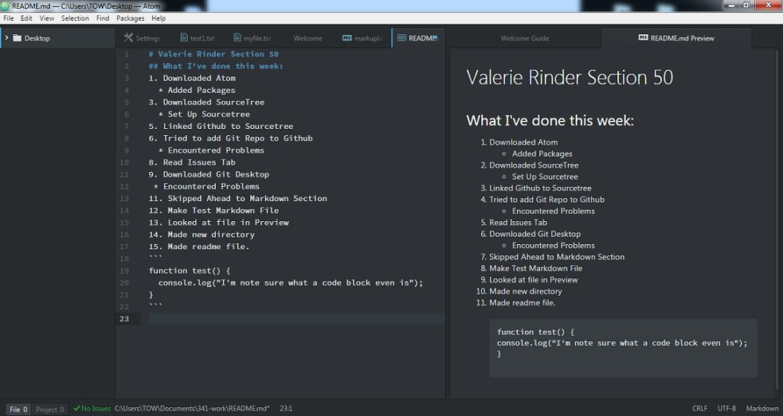

# Valerie Rinder Section 50
## What I've done this week:
1. Downloaded Atom
  * Added Packages
3. Downloaded SourceTree
  * Set Up Sourcetree
5. Linked Github to Sourcetree
6. Tried to add Git Repo to Github
  * Encountered Problems
8. Read Issues Tab
9. Downloaded Git Desktop
 * Encountered Problems
11. Skipped Ahead to Markdown Section
12. Make Test Markdown File
13. Looked at file in Preview
14. Made new directory
15. Made readme file
```
function test() {
  console.log("I'm note sure what a code block even is");
}
```

